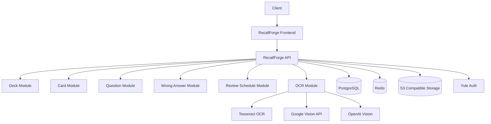

# RecallForge

<p align="center">
  
  
  
</p>

<p align="center">
  
  
  
  
</p>

<p align="center">
  
  
  
  
</p>

<p align="center">
  
  
  
</p>

RecallForge는 노트, 문서, 문제 이미지를 플래시카드와 오답노트, 반복 학습 세션으로 변환하는 셀프호스팅 학습 도구입니다. 

단순히 카드를 만들고 외우는 앱이 아니라, 사용자가 틀린 문제를 다시 학습 가능한 형태로 정리하고,  
약점 개념을 반복 복습할 수 있도록 돕는 개인 학습 시스템을 목표로 합니다.

소스 코드는 공개하지만, 실제 배포 환경은 `Yule Auth`를 통해 허용된 사용자만 접근할 수 있도록 설계합니다.

## Core Features

- 덱 기반 학습 주제 관리
- 낱말 카드 학습 모드
- 객관식 / 주관식 문제 풀이
- 오답노트 자동 저장
- 문제 이미지 업로드
- OCR 기반 문제 텍스트 추출
- OCR 결과 검수 후 문제 저장
- 약점 카드 분류
- 반복 학습 스케줄 관리
- 개인 인증 서비스 연동

## Learning Flow

```text
문제 이미지 / 노트 / 직접 입력
        ↓
카드 또는 문제로 변환
        ↓
낱말 카드 학습
        ↓
문제 풀이
        ↓
오답노트 저장
        ↓
약점 카드 복습
        ↓
반복 학습 일정 등록
````

## Architecture



## Project Direction

RecallForge는 Quizlet 스타일의 플래시카드 학습 경험을 참고하되, 개인 오답노트와 셀프호스팅 학습 환경에 초점을 둡니다.  
특히 자격증 공부, 개발 이론 정리, 언어 학습, 기술 면접 준비처럼 반복 암기가 필요한 학습 흐름을 개인이 직접 관리할 수 있도록 설계합니다.
